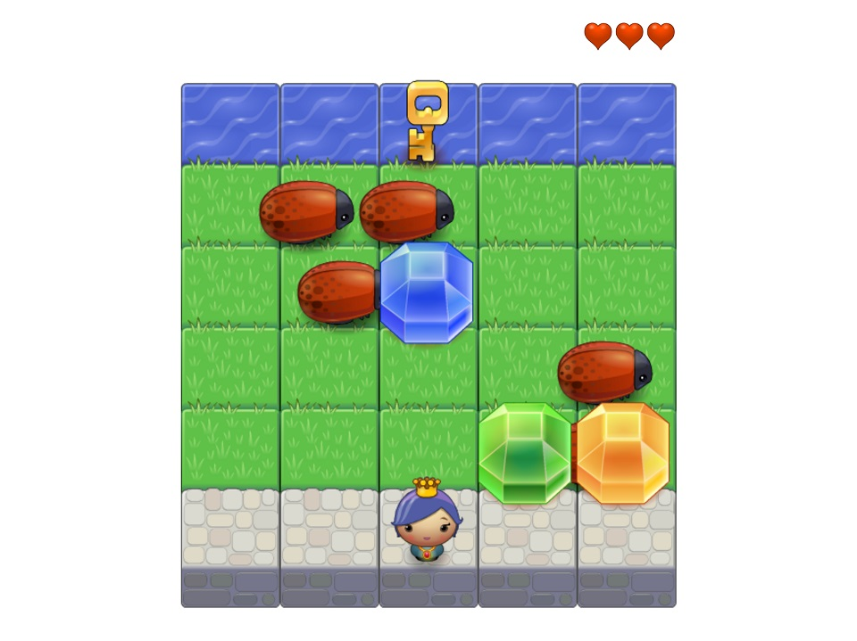

# Princess Lila's Arcade Game

### Description & Motivation

This is the third required project on the [Udacity Front End Nanodegree](https://eu.udacity.com/course/front-end-web-developer-nanodegree--nd001).

This project didn't feel as challenging as the memory card game, maybe because a starter code and game engine was already provided by Udacity. I took the JavaScript Promises and Object Oriented JavaScript extra courses, in addition to the ES6 curriculum, and I felt that that in itself was enough material for me to complete this project.

I relied much less on Stack Overflow and Google this time around. Maybe because this project was more straight-forward or maybe because I am actually getting more used to JS now, whereas I was a real beginner in the previous project and felt quite overwhelmed then. I do feel a difference in the way I interact with code now; it seems much easier to break a big project in small tasks, and to think logically about how to achieve said tasks.

### Project requirements

Use this [rubric](https://review.udacity.com/#!/rubrics/15/view) for self-checking submission. Functions should be  **object-oriented** and the keyword 'this' should be used appropriately. The **readme.md** file should updated with instructions on how to Run and Play the arcade game.

### Tech/framework used

Made with:

* HTML5 Canvas
* CSS custom styles
* Vanilla JavaScript (ES5)

Credits:

* Modal tutorial by [W3 Schools](https://www.w3schools.com/howto/howto_css_modals.asp)

## Demo and usage

#### How to run the game

To run the game locally, [clone](https://github.com/mairamartinsk/arcade-game.git
) this repo or download a [zip file](https://github.com/mairamartinsk/arcade-game/archive/master.zip). Once all files are downloaded and/or extracted to a local folder, open **index.html** on your preferred internet browser.

It's also possible to play the game online via the following live demos:

* Mirror 1 - [Surge](https://callous-driving.surge.sh/)
* Mirror 2 - [Gh Pages](https://mairamartinsk.github.io/arcade-game/)

#### How to play

The player controls the character of *Princess Lila*. The princess' jewels got lost, scattered around the garden. The player needs to retrieve all lost jewels, and after that proceed to collect the key to the palace's safe (the key cannot be collected before the gems). The game ends after the player retrieves the key.

The player starts the game with 3 lives (3 hearts on the top right of the screen). If the player touches a bug, a life is lost. When the player loses all lives, the game is over.

To **start the game**, click anywhere outside of the initial instructions modal. To **restart**, click on the *Play Again* button upon game over or game win, or simply reload the browser's window.

Use arrows **up, down, left, right** to control Princess Lila's movements.

